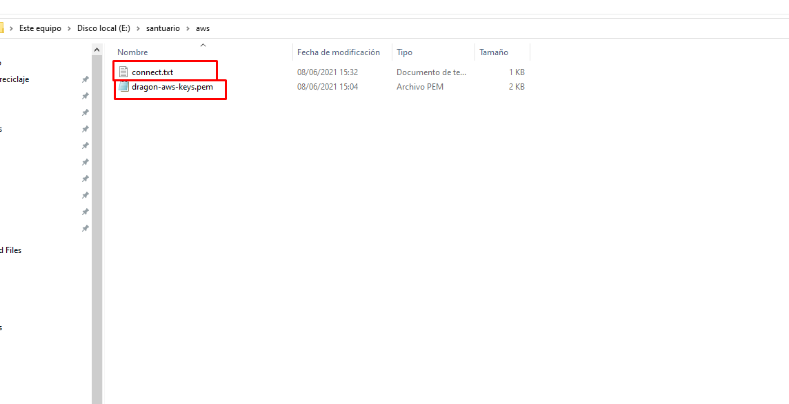

# Configuración de un Servidor de Linux con Amazon AWS

## Lanzamiento

### 1. Dirigirnos a [https://aws.amazon.com](https://aws.amazon.com)


### 2. Configurar una máquina virtual EC2


### 3. Seleccionar el tipo de imagen AMI (Ubutuntu 20.4)


### 4. Seleccionar la opción de capa gratuita


### 5. Crear una VPC por defecto

* __Nota__: La VPC tiene que decir _"Por Defecto"_ o _"Predeterminada"_, sino no se les asignará ninguna IP y no podrán conectarse a su máquina virtual.


### 6. Se crea la VPC por defecto


### 7. Se asigna la VPC predeterminada a la máquina virtual


### 8. Se revisa y lanza la máquina


### 9. Lanzamos la máquina


### 10. Descargar el archivo `.pem` que es la llave para acceder vía `ssh` a nuestro server

* __Nota__: Si el archivo se pierde, no podrá conectarse nuevamente, tendrán que eliminar el servidor.


### 11. Nos dirigimos a las instancias


### 12. Copiamos los datos de la IP y/o el DNS


### 13. Guardamos en un lugar seguro el archivo `.pem` y los datos del server



### 14. En una terminal __Git Bash__ o __Linux__ abrimos la ubicación de la carpeta con el archivo `.pem`


### 15. Abrir en la terminal bash


### 16. Verificar que esté el archivo `.pem`


### 17. Verificar que tengamos anotado el comando de conexión

```bash
ssh -i "path/xxxx.pem" ubuntu@<ip|dns>
```


### 18. Cambiamos los permisos del archivo `.pem` a `0400`

* __Nota__: Se requieren estos permisos en el archivo (grupo de usuario único) para que el server acepte las credenciales.


### 19. Conectarse al server


### 20. Verificar que estemos en el prompt del server


## Instalación de MongoDB en Linux

Docs: [https://docs.mongodb.com/manual/tutorial/install-mongodb-on-ubuntu/]([https://docs.mongodb.com/manual/tutorial/install-mongodb-on-ubuntu/)

> Agregar las claves al `apt`

```bash
wget -qO - https://www.mongodb.org/static/pgp/server-4.4.asc | sudo apt-key add -
```

> Crear la lista del paquete

```bash
echo "deb [ arch=amd64,arm64 ] https://repo.mongodb.org/apt/ubuntu focal/mongodb-org/4.4 multiverse" | sudo tee /etc/apt/sources.list.d/mongodb-org-4.4.list
```

> Actualizar `apt-get`

```bash
sudo apt-get update
```

> Instalar la última versión de Mongo DB Org

```bash
sudo apt-get install -y mongodb-org
```

## Arranque del demonio de Mongo DB

> Iniciar el servicio `mongod`

* __Nota__: El comando `mongod` es la instancia del servidor de Mongo DB, el cuál lo podemos asociar al _"nodo"_ o _"clúster"_.

```bash
sudo systemctl start mongod
```

> Habilitamos el servicio `mongod` para que se encianda automáticamente aún tras un reinicio

```bash
sudo systemctl enable mongod
```

> Para ver el estatus del servicio `mongod`

```bash
sudo systemctl status mongod
```


> Para detener el servicio `mongod`

```bash
sudo systemctl stop mongod
```

> Para reiniciar el servicio `mongod`

```bash
sudo systemctl restart mongod
```

## Acceder a Mongo DB

> Acceso local

```bash
mongo
```

> Acceso remoto

* __Nota__: El `<uri>` es la cadena de conexión.

```bash
mongo <uri>
```

> Acceso remoto ejemplo

```bash
mongo mongodb://18.117.240.224:27017/test
```


