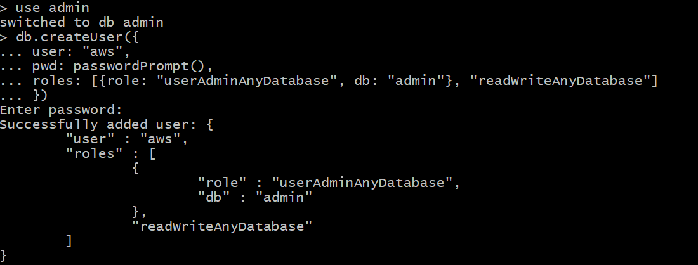
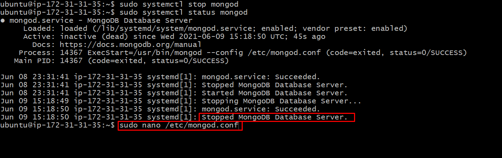
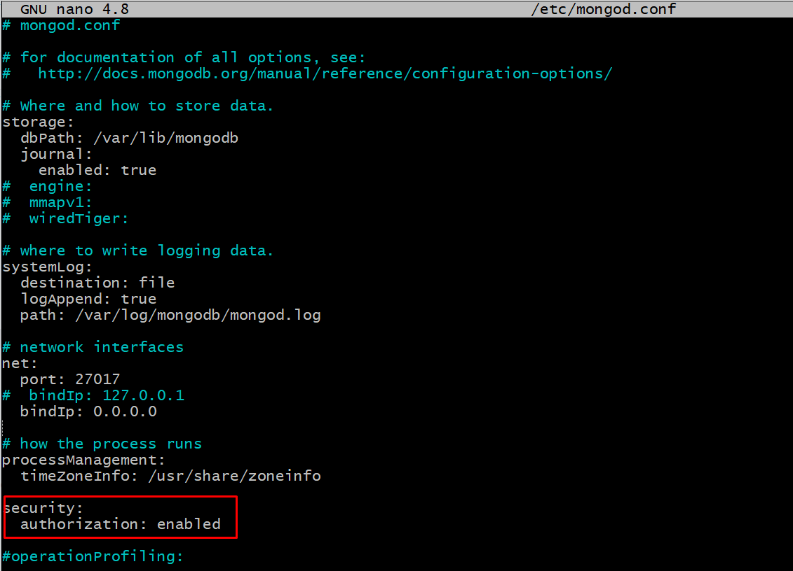
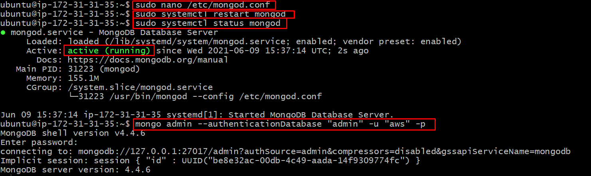
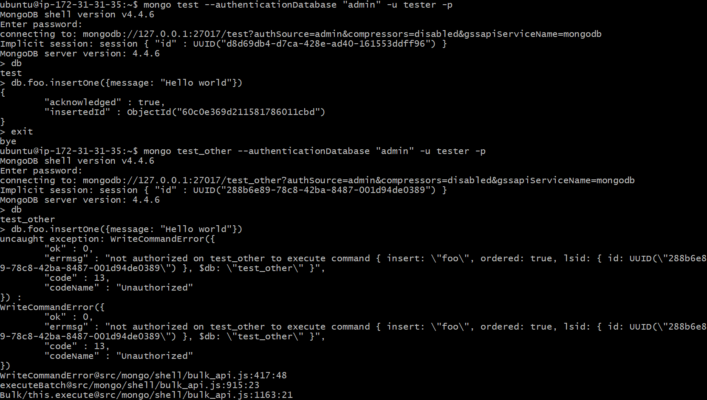
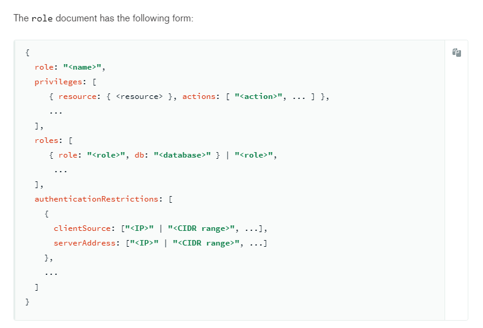

# Habilitar la Seguridad en Mongo DB

## Habilitar el Control de Acceso

Docs [https://docs.mongodb.com/manual/tutorial/enable-authentication/](https://docs.mongodb.com/manual/tutorial/enable-authentication/)

> Si el control de acceso ya estaba habilitado previamente, detener la instancia e iniciarla nuevamente de manera específica

```bash
sudo systemctl stop mongod

mongod --port 27017 --dbpath /var/lib/mongodb
```

> Acceder a al shell con `mongo`

```bash
mongo --port 27017
```

## Crear el usuario administrador

> Cambiarnos a la base de datos `admin`

```bash
use admin
```

> Crear el usuario administrador, asignando los roles para administrar usuarios y leer y escribir cualquier base de datos

* __Nota__: Pueden colocar la contraseña `pwd: "my-password"` en lugar de usuar `passwordPrompt()`

```bash
db.createUser({
    user: "aws",
    pwd: passwordPrompt(),
    roles: [{role: "userAdminAnyDatabase", db: "admin"}, "readWriteAnyDatabase"]
})
```



## Habilitar la seguridad en la instancia `mongod`

> Detener el servicio de `mongod`

```bash
sudo systemctl stop mongod
```

> Editar el archivo de configuración de la instancia `mongod`

```bash
sudo nano /etc/mongod.conf
```



> Agregar la seguridad

* __Nota__: La etiqueta `security` viene por defecto comentada, no olvidar descomentar `#security -> security`

```bash
security:
  authorization: enabled
```



> Verificamos el acceso al usuario admin (`aws`)

```bash
mongo admin --authenticationDatabase "admin" -u "aws" -p
```



## Agregamos usuarios con roles específicos a las bases de datos

> Creamos el usuario `tester`

```bash
db.createUser({
    user: "tester",
    pwd: "tester123",
    roles: [ { role: "readWrite", db: "test" }, { role: "read", db: "reports" } ]
})
```

> Verificamos el acceso del usuario `tester`

```bash
 mongo test --authenticationDatabase "admin" -u tester -p
```



## Crear roles específicos

Docs: 

* Ver los roles, recursos y acciones predefinidas: [https://docs.mongodb.com/manual/reference/built-in-roles/](https://docs.mongodb.com/manual/reference/built-in-roles/)
* Crear roles específicos: [https://docs.mongodb.com/manual/core/security-user-defined-roles/](https://docs.mongodb.com/manual/core/security-user-defined-roles/)
* Crear un role mediente `db.createRole(...)` [https://docs.mongodb.com/manual/reference/method/db.createRole/#mongodb-method-db.createRole](https://docs.mongodb.com/manual/reference/method/db.createRole/#mongodb-method-db.createRole)
* Lista de acciones: [https://docs.mongodb.com/manual/reference/privilege-actions/#std-label-security-user-actions](https://docs.mongodb.com/manual/reference/privilege-actions/#std-label-security-user-actions)
* Lista de la colección de roles del sistema: [https://docs.mongodb.com/manual/reference/system-roles-collection/#mongodb-data-admin.system.roles.privileges](https://docs.mongodb.com/manual/reference/system-roles-collection/#mongodb-data-admin.system.roles.privileges)

## Ejemplo: Sintaxis para crear roles personalizados



### Ejemplo: Privilegios asignados en un role por el usuario

