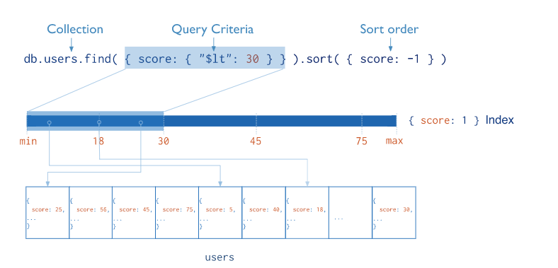
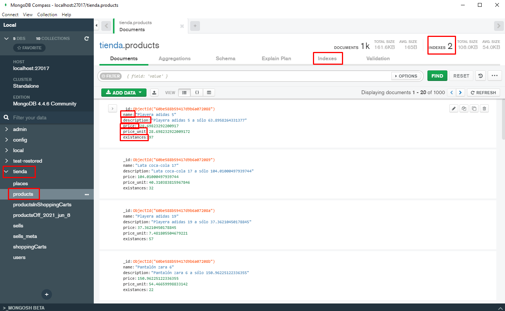
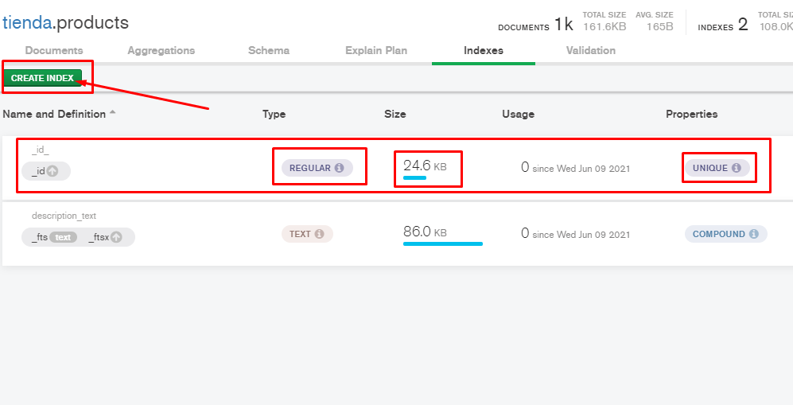
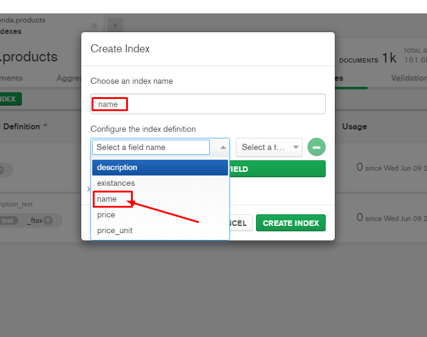
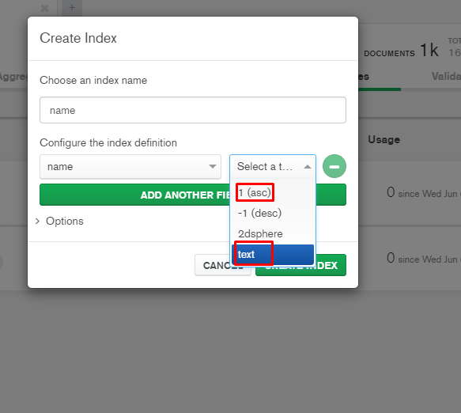
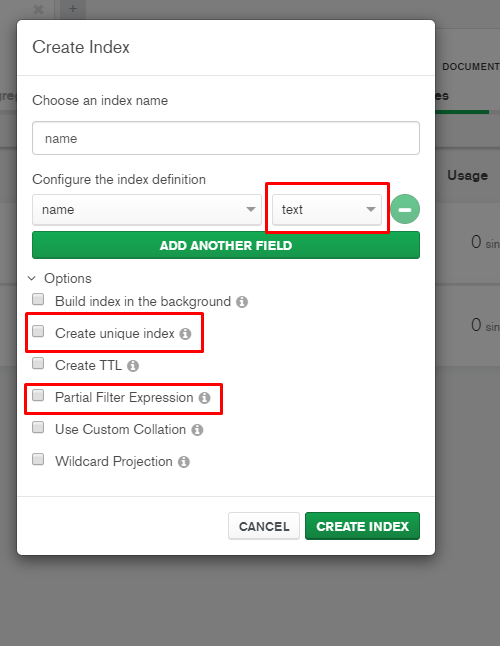

# Indexación en Mongo DB

## Introducción a los Índices

Docs: [https://docs.mongodb.com/manual/indexes/](https://docs.mongodb.com/manual/indexes/)

* Aportan información sobre los valores retenidos en los campos de los documentos en las colecciones
* Sirven para que Mongo DB mejore el rendimiento y optimice las consultas de forma automática
* Definen un tipo de valor y Mongo DB lo utiliza para guardar algunos valores de pivote o regiones (`boundaries`) que agrupan los documentos y al realizar las consultas limita el número de documentos sobre los que se efectuará la consulta.
* Indexar nuestras colecciones es una buena práctica para mejorar la eficiencia de las consultas, el almacenamiento y simplicar las cargas de operaciones, sobre todo al usar `Replica Sets` y ``Shardings` (`Clústers`).



## Crear índices mediante compás (`Mongo DB Compass`)

### Seleccionar la colección a indexar e ir a la pestaña de índices



### Crear el índice



### Seleccionar el campo (`<field>`)



### Seleccionar el campo (seleccionar el tipo)



### Ajustar colaciones avanzadas



## Crear Índices mediante el shell

Docs: [https://docs.mongodb.com/manual/reference/method/db.collection.createIndex/](https://docs.mongodb.com/manual/reference/method/db.collection.createIndex/)

```bash
db.<collection>.createIndex(
  {
      <field>: 1 // 1 - asc | -1 - desc | "text" | "2d" | "2dsphere" | "hashed" | ...
  },
  { // https://docs.mongodb.com/manual/reference/method/db.collection.createIndex/#options
      unique: true,
      sparse: true,
      expireAfterSeconds: 3600
  }
)
```